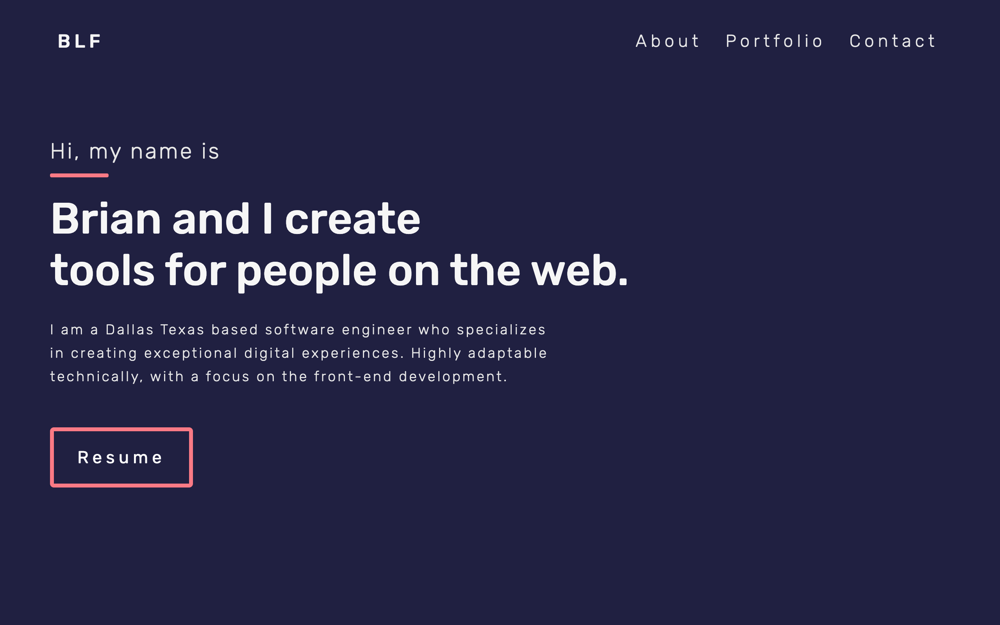

# Brian Farmer Web Dev Portfolio

This site my Dev Portfolio- It is an ever-changing work in progress as I continue to work towards developing my technical skills. Current version is Version 3.

The page is built with React.js. Currently the site consists of a single page layout with divided into 4 main sections. The landing section, about me, portfolio, and contact. A navigation bar anchors to the corresponding sections of the page.

## Table of contents

- [Overview](#overview)
- [The challenge](#the-challenge)
- [Screenshot](#screenshot)
- [Links](#links)
- [My process](#my-process)
- [Built with](#built-with)
- [What I learned](#what-i-learned)
- [Continued development](#continued-development)
- [Useful resources](#useful-resources)
- [Author](#author)

## Overview

### The challenge

The user should be able to:

- Navigate the site in desktop and mobile views
- Use the navigation menu to move to the corresponding page
- Navigation should auto hide on scroll down and reveal on scroll up
- View section animations when section enters view port
- View and download my resume in pdf form
- Send a contact form to netlify forms

### Screenshot



### Links

- GitHub URL: [https://github.com/brianlfarmerllc/dev_portfolio_v3](https://github.com/brianlfarmerllc/dev_portfolio_v3)
- Live Site URL: [https://brianfarmerwebdev.netlify.app/](https://brianfarmerwebdev.netlify.app/)

## My process

### Built with

- React.Js
- Node.Js
- Semantic HTML5 markup
- SASS preprocessor
- Netlify Forms
- Github API
- Custom Hooks

### What I learned

I learned a lot in this project, a few things that stand out are the use of custom hooks to view the y axis position to auto hide and show the header and using the intersection observer to run small animations when entering a section. The thing that will be the most helpful was how to use the github public API and their REST API.

Im using the public API to generate all projects in the "Other Noteworthy Projects" section by fetching all my repos and filtering the data by starred projects and setting the data to a useState hoook. Then simply mapping over the data and creating the cards with details I want to display. I also found that I could fetch the topics on each repo individualy with the github rest API. This is going to help me a lot with keeping my portfolio fresh. All Ill have to do is star the projects I want to display and make sure the info is correct in git hub and poof a new or updated card is created.

```jsx
function Projects() {
  const [projects, setProjects] = useState([]);

  useEffect(() => {
    loadProjects();
  }, []);
  // when the component mounts the public api fetch is made
  const loadProjects = () => {
    api.getProjects().then((res) => {
      const starProjects = res.filter(
        (project) => project.stargazers_count > 0
      );
      // filtered data set to projects state
      setProjects(starProjects);
    });
  };

  return (
    <section ref={sectionRef} id="projects" className="projects">
          {/* project state mapped over creating project cards */}
          {projects.map((project, index) => (
            <ProjectCard key={index} info={project} />
          ))}
        </div>
      </div>
    </section>
  );
}
```

```jsx
// a second GET request is made when each <ProjectCard /> is being generated to fetch the repo topics since the information is not available in the public API.
function ProjectCard({ info }) {
  const [tech, setTech] = useState([]);

  useEffect(() => {
    api.getTopics(info.owner.login, info.name).then((res) => {
      setTech(res);
    });
  }, [tech]);
```

### Continued development

Learning

### Useful resources

- [GitHub REST API Topic Endpointt](https://docs.github.com/en/rest/reference/repos#get-all-repository-topics) - Hard to notice but you also have to use the documentation linked in the octokit/core.js to generate a token to use the REST api to have access to this endpoint.
- [React Hook Header Auto Hide](https://medium.com/mtholla/create-a-transitioning-header-using-react-hooks-like-mediums-c70ed211f7c9) - I do not think I would have been able to do it without this article. Very detailed and a good read.
- [Brittany Chiang inspiration](https://brittanychiang.com/) - I was inspired a lot by this portfolio. I like how she found useful ways to use both Grid and flexbox layouts.

## Author

- Website - [Brian Farmer](https://brianlfarmerllc-biosite.netlify.app/)
- GitHub URL: - [GitHub URL](https://brianfarmerwebdev.netlify.app/)
